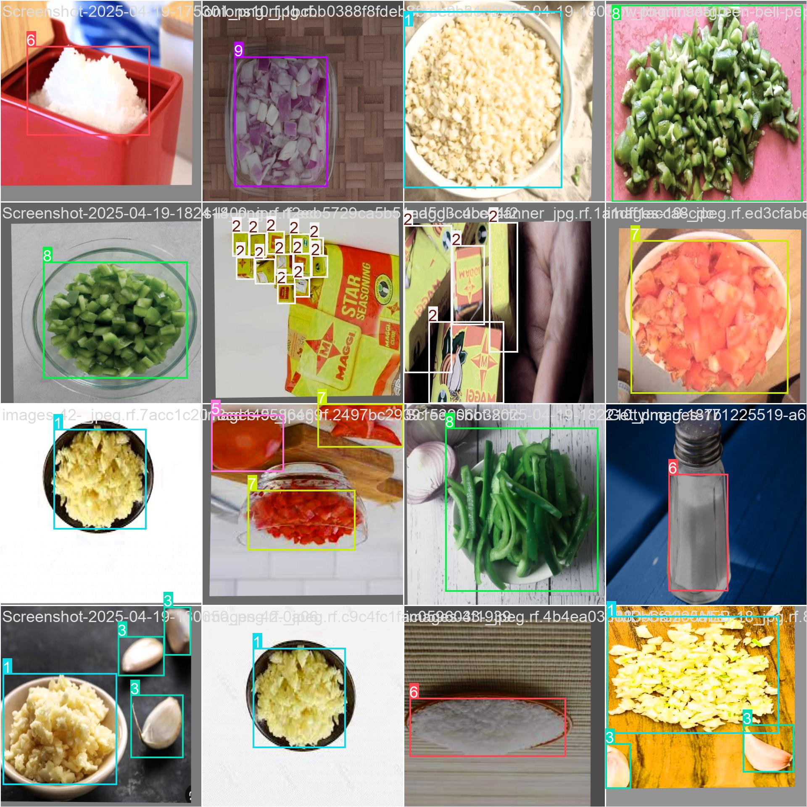
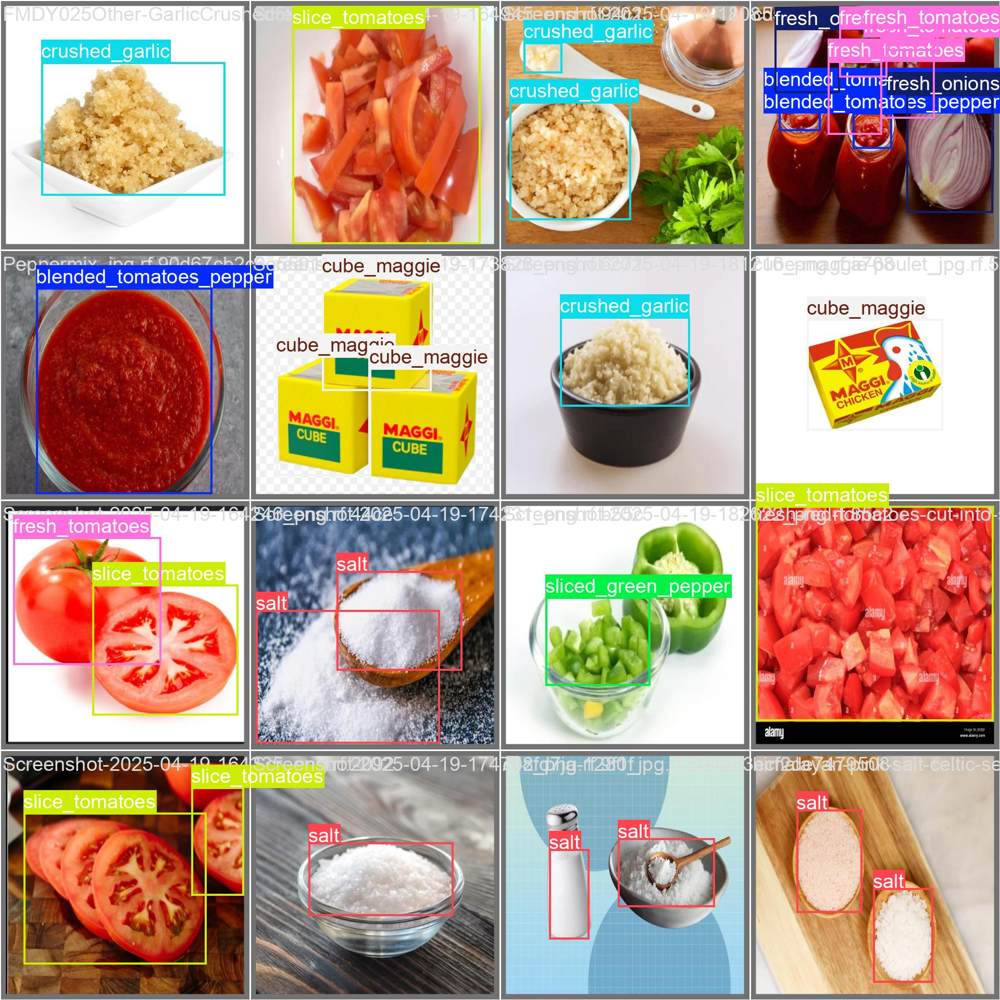

# VortexArm

VortexArm is a modular, extensible bionic arm, with a focus on real-world deployment, research, and education. It uses a dataflow architecture (dora-rs) for flexible integration of kinematics, actuation, and perception modules.

---

## Table of Contents

- [Project Structure](#project-structure)
- [Features](#features)
- [Getting Started](#getting-started)
- [Usage](#usage)
- [Contribution Guide](#contribution-guide)
- [YAML Specification](#yaml-specification)
- [Examples](#examples)

---

## Project Structure

```
VORTEXARM/
├── src/
│   ├── inverse_kinematics/
│   │   ├── inverse_kinematics/
│   │   │   ├── __init__.py
│   │   │   ├── __main__.py
│   │   │   ├── inverse_kinematics.py
│   │   │   ├── main.py
│   │   │   ├── robot_config.py
│   │   │   └── simulator.py
│   │   ├── inverse_kinematics.egg-info/
│   │   └── tests/
│   ├── ssc32u_controller/
│   │   ├── ssc32u_controller/
│   │   │   ├── __init__.py
│   │   │   ├── __main__.py
│   │   │   ├── main.py
│   │   │   ├── robot_config.py
│   │   │   └── ssc32u.py
│   │   ├── ssc32u_controller.egg-info/
│   │   └── tests/
│   └── vision/
│       ├── vision/
│       │   ├── __init__.py
│       │   ├── __main__.py
│       │   ├── main__.py
│       │   ├── object_detection.py
│       │   ├── plot.py
│       │   ├── utils.py
│       │   ├── webcam.py
│       │   ├── yolov8n.pt
│       └── tests/
├── dataflow-graph.html
├── dataflow.yml
├── requirements.txt
├── yolov8n.pt
├── pyproject.toml
├── uv.lock
├── README.md
└── .gitignore
```

---

## Features

- **Inverse Kinematics:**  
  Compute joint angles for desired end-effector positions.

- **SSC-32U Servo Controller Integration:**  
  Python interface for the Lynxmotion SSC-32U, supporting up to 32 servos, synchronized/group moves, and feedback querying.

- **Vision Module:**  
  Camera and object detection integration (YOLOv8), enabling perception-driven manipulation.

- **Simulation:**  
  Test and validate algorithms in a simulated environment.

- **Dataflow Orchestration:**  
  Modular nodes defined in `dataflow.yml` for flexible, scalable system integration.

---

## Getting Started

**Prerequisites:**

- Python >3.11
- [uv](https://github.com/astral-sh/uv) (fast Python package management)
- [dora](https://github.com/dora-rs/dora) (dataflow orchestration)

**Installation:**

```bash
git clone https://github.com/attahiruj/VortexArm.git
cd VortexArm
uv venv -p 3.11 --seed
dora build dataflow.yml --uv
```

**Running the Project:**

```bash
uv pip install -r requirements.txt
dora up
dora start dataflow.yml --attach
```

---

## Usage

- All main modules (inverse kinematics, controller, vision) are in `src/`.
- Configure your robot in `robot_config.py` files.
- Connect modules using `dataflow.yml`.
- For vision-based tasks, ensure `yolov8n.pt` is present, can be replaced with compatible YoLO models.

---

## Yolo model finetuned on custom dataset for Food Ingredients needed to cook Jollof Rice
- Loaded pre-trained model of Yolo(V12) 
- Trained pre-trained model(YoloV12) on custom Dataset
- Finetuned Yolov12 on custom dataset(Coco format) containing cooking ingredients.
- Validated and Tested model preform on our custom datatest for detecting food ingredients
- * Results below:



## Contribution Guide

- **Format code with [ruff](https://docs.astral.sh/ruff/):**
  ```bash
  uv pip install ruff
  uv run ruff check . --fix
  ```
- **Lint code with ruff:**
  ```bash
  uv run ruff check .
  ```
- **Run tests with [pytest](https://github.com/pytest-dev/pytest):**
  ```bash
  uv pip install pytest
  uv run pytest .
  ```

---

## YAML Specification

The `dataflow.yml` file defines the nodes, their connections, and runtime parameters for the system. Modify this file to add, remove, or reconfigure modules.

---


## Examples

- **Inverse Kinematics:**  
  Use the `inverse_kinematics` module to compute joint angles for a target position.
- **Servo Control:**  
  Send joint commands to the SSC-32U controller for real-world actuation.
- **Vision:**  
  Run object detection using the YOLOv8 model and trigger arm movement based on detections.
